# My Tinder Clone

A pet project simulating core Tinder functionality – profile browsing, swiping, and matching – built with Python and FastAPI.
The main goal is to practice Python (FastAPI, SQLAlchemy), Docker, microservices architecture, Clean Architecture concepts, and deployment. A React SPA frontend is planned.

## Technologies & Stack
### Back-end:

- Python 3.12
- FastAPI
- SQLAlchemy
- Redis
- PostgreSQL
- Kafka (asynchronous messaging)
- Docker
- CI/CD

### Front-end:
- React SPA (planned)

## Architecture:

- Follows **Clean Architecture** principles with *Domain* / *Application* / *Infrastructure* / *Presentation* layers.

- Organized as modular microservices – each encapsulates a specific domain responsibility and communicates via Kafka events.

- Each microservice follows a Clean Architecture layout and leverages FastAPI + async SQLAlchemy.

## Overview
This repository is split into multiple microservices:

| Service             | Description                        | Status       |
|---------------------|------------------------------------|--------------|
| profile-service     | Manages profiles and preferences   | ✅ Done       |
| deck-service        | Generates daily user decks         | ✅ Done       |
| swipe-service       | Handles swipe actions              | ✅ Done       |
| auth-service        | Auth (JWT, registration)           | 🟡 Planned    |
| notification-service| Sends Kafka-based notifications    | 🟡 Planned    |
| client              | React frontend                     | 🟡 Planned    |

## Folder Structure in Each Microservice

-  **_domain/_**: Domain models, business logic, and abstract interfaces (repositories, etc.)
-  **_use_cases/_**: Use cases/services that orchestrate domain logic
-  **_infrastructure/_**: Implementations of repositories, database adapters, Kafka integration, etc.
-  **_presentation/_**: HTTP routes (endpoints), Pydantic request/response schemas

Additionally:

**_client/_**: A placeholder folder for the future React frontend

**_kafka/_**: Docker configuration for Kafka

**_scripts/_**: Helper shell scripts (to be replaced with **Makefiles** later)

> ### Note: All microservices are in a single repository to simplify interaction during development. In a production environment, splitting them into separate repositories is generally recommended.

## System Architecture (Mermaid Diagram)

```mermaid
flowchart TD
    subgraph Client["Client"]
        A1["🧑‍💻 React SPA (planned)"]
    end

    subgraph APILayer["API Layer"]
        GW["🌐 API Gateway (planned: Traefik)"]
    end

    subgraph Services["Microservices"]
        Profile["👤 profile-service (Manages user profiles)"]
        Deck["🃏 deck-service (Generates matching decks)"]
        Swipe["💚 swipe-service (Handles swipe actions and matches)"]
        Auth["🔐 auth-service (planned)"]
        Notification["🔔 notification-service (planned)"]
    end

    subgraph DB["PostgreSQL Databases"]
        DB1["📦 PostgreSQL (Profile)"]
        DB2["📦 PostgreSQL (Deck)"]
        DB3["📦 PostgreSQL (Swipe)"]
    end

    subgraph Infra["Infrastructure"]
        Redis["🧠 Redis (Cache)"]
        Kafka["🛰 Kafka (Message Broker)"]
    end

    A1 --Authentication (Login/Register)--> GW
    Auth --Generates JWT--> A1
    A1 --Subsequent requests with Bearer <JWT>--> GW

    GW --> Profile
    GW --> Deck
    GW --> Swipe

    GW --Handles Login/Register requests--> Auth

    Profile --Stores/Retrieves profile data--> DB1
    Profile --Publishes profile data updates--> Kafka

    Deck --Stores deck data--> DB2
    Deck --Caches deck data--> Redis
    Kafka --Consumes profile data--> Deck

    Swipe --Stores swipe data--> DB3
    Swipe --Publishes match events--> Kafka

    Kafka --Consumes swipe events--> Notification
    Notification --Sends notifications to Client--> A1
```

## Development Plan

 - [x] Improve **error handling**

 - [x] **Logging** (with trace id)

 - [ ] **Testing**

 - [ ] **Create user → profile → preferences in one step**

 - [ ] **Replace .sh scripts with Makefiles**

 - [ ] **Frontend** (React SPA)

 - [ ] **Authorization** (login, registration, JWT)

 - [ ] **Deployment**

    - [ ] Set up CI/CD pipeline (GitHub Actions)

    - [ ] Configure API Gateway (Traefik) for routing and rate limiting

 - [ ] **Notification-service** for mutual likes (via Kafka)

 - [ ] **PUT/DELETE endpoints** in profile-service & update deck-service via Kafka

 - [ ] **Use UUID** instead of numeric IDs

 - [ ] **Daily deck generation by cron** (if last generation was X hours ago)
